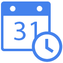
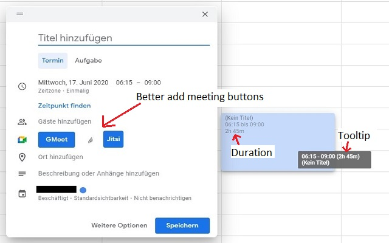
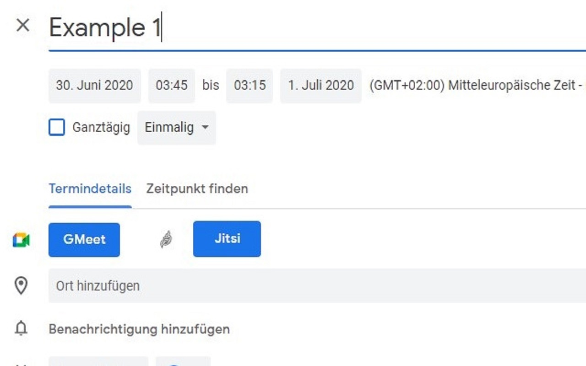
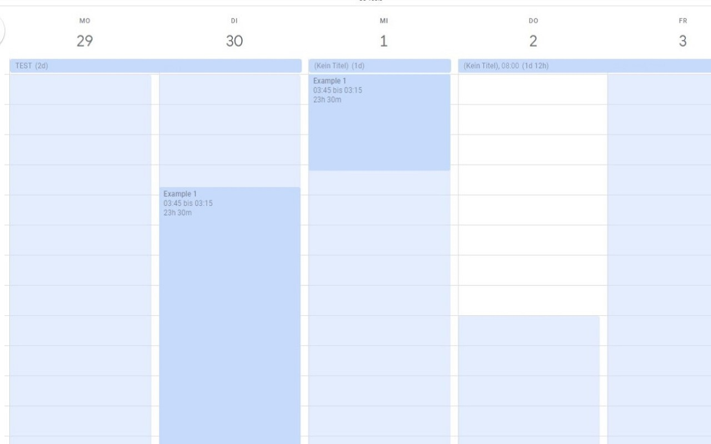
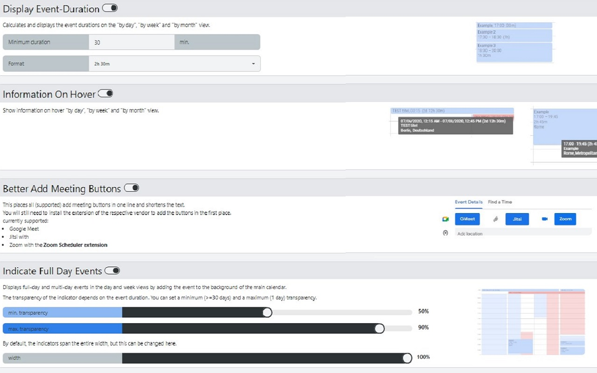

    

  <h3 align="center">Google-Calendar-Tools</h3>

  

    An extension that provides multiple small tools for the Google Calendar™.
     
    <a href="https://github.com/vncnt-dev/Google-Calendar-Tools/issues">Report Bug</a>
    ·
    <a href="https://github.com/vncnt-dev/Google-Calendar-Tools/issues">Request Feature</a>
  

</img>

## Display Event-Duration:

Calculates and displays the event durations on the "by day", "by week" and "by month" view.

## Information On Hover:

Show information on hover "by day", "by week" and "by month" view.

## Better Add Meeting Buttons:

This places all (supported) add meeting buttons in one line and shortens the text.
You will still need to install the extension of the respective vendor to add the buttons in the first place.
</img>
## Indicate Full-Day Events:

Displays full-day and multi-day events in the day and week views by adding the event to the background of the main calendar.

</img>

## Configurable Settings:
</img>

This project contains icons from the [Material Design Icons](https://materialdesignicons.com/) project.
[LICENSE](https://github.com/Templarian/MaterialDesign/blob/master/LICENSE)
