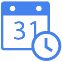
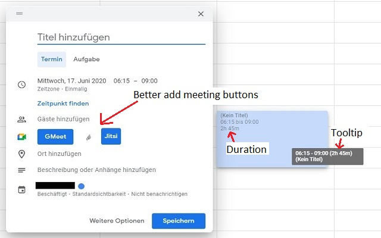
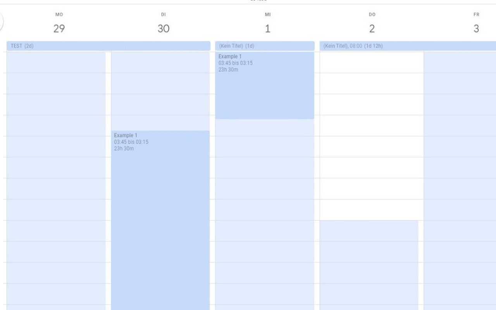
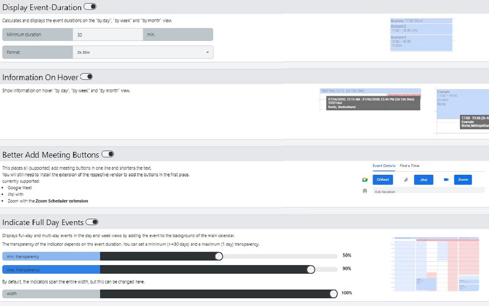

    

  <h3 align="center">Google-Calendar-Tools</h3>

  

    An extension that provides multiple small tools for the Google Calendar™.
     
    <a href="https://github.com/vncnt-dev/Google-Calendar-Tools/issues">Report Bug</a>
    ·
    <a href="https://github.com/vncnt-dev/Google-Calendar-Tools/issues">Request Feature</a>
  

</img>

## Display Event-Duration:

Calculates and displays event durations in day, week/multiple-day and month/multiple-week views. Select the views independently in **Display Event-Duration → Active in**. In compact month cells, the duration stays on the existing line and is hidden when there is not enough space for the event title.

## Information On Hover:

Show event information on hover in the views selected under **Information On Hover → Active in**. This selection is independent of the visible event duration: for example, hide durations in month view and keep them available on hover.

Custom views follow their layout: week and seven-day views share one setting, while custom multi-week grids share the month setting. All views are enabled by default, preserving existing preferences. The main feature switches keep the selected views when turned off. Changes apply without reloading the calendar; agenda and year views are not supported.

## Remove Google Meets Buttons:

Removes the Google Meet™ buttons from the event details page and the quick add dialog. This is useful if you don't use Google Meet™.

## Indicate All-Day and Multi-Day Events:

Displays all-day and multi-day events in the day and week views by adding the event to the background of the main calendar.

</img>

## Configurable Settings:

</img>

## Development checks

Run `pnpm check-ts`, `pnpm test`, and `pnpm build`. DOM regression fixtures and the manual browser checklist are documented in [tests/README.md](tests/README.md).
